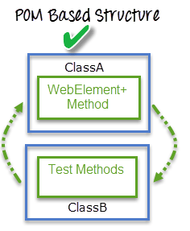

# Github automate smoke test

## Table of contents
* [Introduction](#introduction)
* [How to run test case](#how-to-run-test-case)
* [Built with](#built-with)
* [Directory tree structure](#directory-tree-structure)
* [Author](#author)

## Introduction
Validate Github search and navigation with the following steps: 

First scenario: 
1. Go to google.com and search for "Github"
2. Search github user
3. Access repository

Second scenario:
1. Go to google.com and search for "Github"
2. Click to navigation bar
3. Cick on site map

## How to run test case
* `$ mvn clean`
* `$ mvn install` 
* `$ mvn install` should automatically run Test Runner class `src/test/java/app/test/RunnerTest.java`
* or you can run `$ mvn test` 

Test runner should automatically grab feature file:
* Test runner class use `@CucumberOptions` annotations
* Configure feature path using `@CucumberOptions(features = "{path}")`
* Set Test case `GithubSmokeTest.feature` under `src/test/resources`

Test Result:
* After build is run, display test result in terminal
* Generate Html report `cucumber-html-reports.html` automatically under `target`
* Use`@After` cucumber hook for tear down each scenario
* For every failed scenarios, screenshot will be taken and embedded in html report

   
## Built with
* Cucumber
* BDD
* Java
* Junit
* Page Factory
* Page Object Model (POM)


source:https://www.guru99.com/page-object-model-pom-page-factory-in-selenium-ultimate-guide.html

## Directory tree structure
```
├───src
│   ├───main
    │   ├───java
    │   │   └───com
    │   │       └───example
    │   │           └───app
    │   │               ├───common
	│	│				│	    └───Utility
    │   │               ├───pages
	│	│				│		├──BasePage
	│	│				│		├──GithubAboutPage
	│	│				│		├──GithubBasePage
	│	│				│		├─GithubHomePage
	│	│				│		├──GithubRepositoryPage
	│	│				│		├──GithubSearchResultPage
	│	│				│		├──GoogleHomePage
	│   │               │       └──GoogleSearchResultPage
    │   │               └───webdriver
	│	│						├──ChromeBrowser
	│	│						├──Driver
	│	│						└──DriverFactory
    │   └───resources
    │       └───driver
    │           └───chrome
	│				└───chromedriver
    └───test
		├───RunTests
        ├───java
        │   └───app
        │       └───test
        │           ├───hooks
		│			│	└──CucumberHooks
        │           ├──steps
		│			│	 ├───BasePageSteps
		│			│	 ├───GithubAboutPageSteps
		│			│	 ├───GithubBasePageSteps
		│			│	 ├────GithubHomePageSteps
		│			│	 ├──GithubRepositoryPageSteps
		│			│	 ├──GithubSearchResultPageSteps
		│           │    ├──GoogleHomePageSteps
		│           │    └─ GoogleSearchPageSteps
		│           └──RunnerTest
		│
		│				   
       	└───resources
				└──GithubSmokeTest.feature
``` 

* `Helper.java` for code reusablility
* `/pages` pages are created according to page object model, create object repository to store all web UI elements and its page-related methods
* `/webdriver` for all webdriver related class
* `DriverFactory.java` a factory class to set up driver for test
* `Driver.java` an interface, create abstract methods that child class has to override
* `ChromeBrowser.java` implements driver parent class, to set property and initialise chromedriver
* `RunnerTest` use cucumberhooks to set cucumberoptions
* `CucumberHooks` takes care of @Before and @After set up and failed screenshot
* `/steps` steps will be called in test scenarios, steps are divided according to each page
* `resources/` test case designed with Gherkin language

## Author
* Contributor: Rebecca
* Date: 11/11/2021